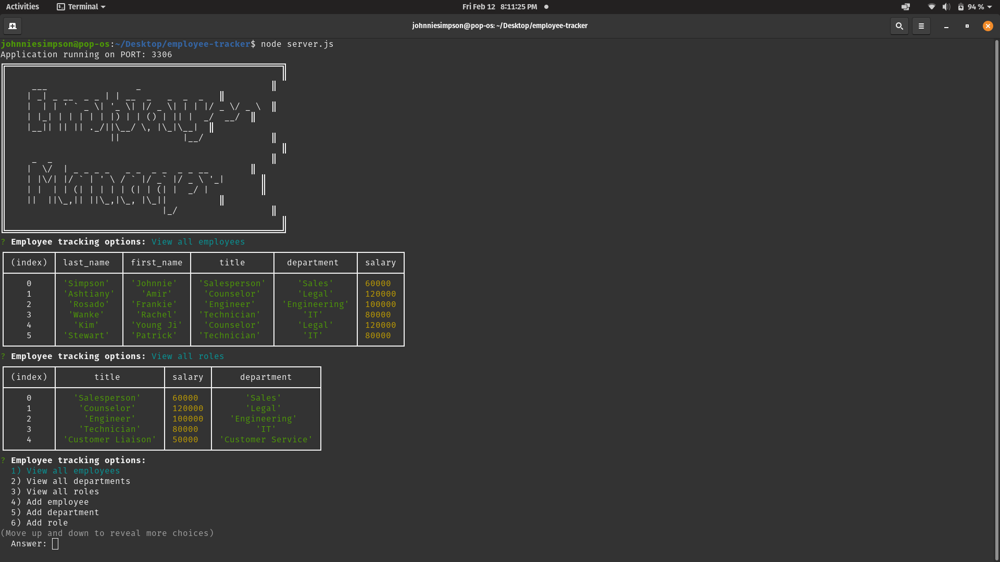

# Employee Tracker

  [](https://www.gnu.org/licenses/gpl-3.0)

  ## Table of Contents

  - [Description](#description)

  - [Application Links](#links)

  - [Screenshots](#screenshots)

  - [Usage](#usage)

  - [Contributing](#contributing)

  - [Tests](#tests)

  - [Questions](#questions)

  - [Acknowledgments](#acknowledgments)

  - [Licenses](#licenses)

  ## Description

  An employee tracking program that runs in the terminal and utilizes a MySQL database for backend data storage and retrieval.

  ## Links

  YouTube demo: https://www.youtube.com/watch?v=7OfIQ9I4G4g&feature=youtu.be

  Repo: https://github.com/balokdecoy/employee-tracker 

  ## Screenshots

  

  ## Usage

  Fork the repo to your machine. Install dependencies (see installation instructions above). Run program by entering 'node server.js'. User is presented with 8 options. Select an option by using the up and down arrows or entering the number of the desired option. View employees, view departments, and view roles will display info in table format. Add employees, add departments, and add roles will ask for user information to create new employees, departments, and roles. Update employee role allows the user to update the title and salary of a previously created role. Exit option kills the connection and ends the program. 

  ## Contributing

  This project is free open-source software (FOSS). Please contact me if you would like to contribute. See contact details below.

  ## Tests

  ```bash
  npm test

  ```
  ## Questions

  Visit my Github profile at http://www.github.com/balokdecoy.

  If you have questions, you can reach me via email at johnniesimpson88@gmail.com.

    ## Acknowledgments

  Special thanks to Amir Ashtiany who helped considerably with the update employee role functionality and helped turn my over-complicated ideas into something far more sensible. 

  Thanks also to Young Ji Kim, Frankie Rosado, and Rachel Wanke for their feedback, support, and brainstorming. Visit their Github pages here:

  1. Amir Ashtiany - https://github.com/Alexfit4
  2. Young Ji Kim - https://github.com/youjmi
  3. Frankie Rosado - https://github.com/Franciscorosado09
  4. Rachel Wanke: - https://github.com/rwanke14 

  ## Licenses
 Licensed under [GPL v3](https://www.gnu.org/licenses/gpl-3.0)

